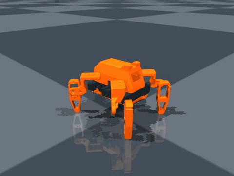
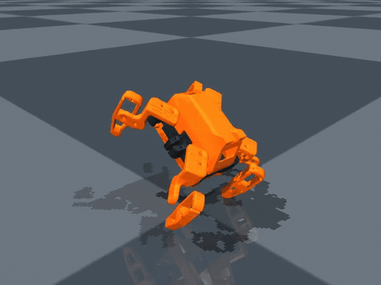
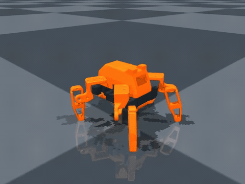
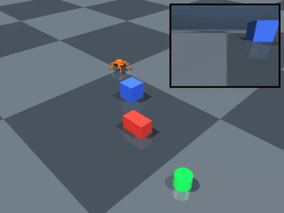
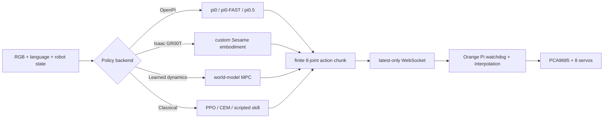

https://github.com/user-attachments/assets/af09253b-c84b-466e-a2fe-e9614ec87699


# Sesame ML

Simulation, reinforcement learning, online planning, dataset tooling, and remote VLA control
for the eight-servo [Sesame quadruped](https://github.com/dorianborian/sesame-robot).

[](LICENSE)


Sesame ML turns the printable hobby quadruped into a small, reproducible platform for
locomotion policies, vision-language navigation, action-chunk VLAs, world models, and
sim-to-real experiments. It ships the meshes, MuJoCo model, URDF, task environments,
training/evaluation code, dataset tooling, policy adapters, and the software-watchdog-bounded
Wi-Fi runtime.
It does **not** ship a pretrained policy that is automatically safe on a physical robot.

## Simulator renders

| Stable stance | Recovery task |
|---|---|
|  |  |
| [50 fps MP4](docs/media/stand.mp4) · [JSON](docs/media/reports/stand/report.json) · [CSV](docs/media/reports/stand/episodes.csv) | [50 fps MP4](docs/media/recovery.mp4) · [JSON](docs/media/reports/recovery/report.json) · [CSV](docs/media/reports/recovery/episodes.csv) |

| Firmware motion baseline | Navigation overview + policy camera |
|---|---|
|  |  |
| [50 fps MP4](docs/media/firmware-gait.mp4) · [JSON](docs/media/reports/firmware-gait/report.json) · [CSV](docs/media/reports/firmware-gait/episodes.csv) | [50 fps MP4](docs/media/navigation-split.mp4) · [JSON](docs/media/reports/navigation-split/report.json) · [CSV](docs/media/reports/navigation-split/episodes.csv) |

The firmware and navigation clips are regression baselines, not claims of learned task
success. Every video has a JSON/CSV evaluation report; learned checkpoints must pass the
tracking, fall, collision, latency, and domain-randomized gates before hardware use.

## What is included

| Layer | Included implementation |
|---|---|
| Robot description | Self-contained printable STLs, CAD-derived MJCF, validated URDF, camera/IMU/foot frames, primitive contact geometry, masses and actuator limits |
| Tasks | Stand, challenged recovery, commanded locomotion, and goal/obstacle navigation |
| Policy evaluation | Multi-seed JSON/CSV reports, strict task success, domain parameters, tracking/fall/collision/energy/latency metrics, MP4/GIF and onboard/split views |
| Online planning | Receding-horizon CEM through live MuJoCo dynamics and footprint-inflated A* routing |
| RL | Resumable Stable-Baselines3 PPO and optional MuJoCo Playground/MJX/Brax PPO for CUDA-scale training |
| VLA/world-action | Framework-neutral observation/action-chunk contract, OpenPI and GR00T clients, fine-tuning templates, canonical trajectory recorder, LeRobot export |
| Sim-to-real | The same MessagePack/WebSocket protocol for MuJoCo and hardware, latest-only chunks, interpolation, anti-replay checks, TTLs, reconnect metrics and watchdog |
| Robot runtime | Orange Pi camera, BNO085 IMU, PCA9685 PWM, calibrated limits, slew limiting and software-timeout output disable |


## Install

The repository is standalone; no Sesame firmware or CAD checkout is required at runtime.

```bash
cd sesame-ml
uv venv --python 3.11
uv sync --extra train --extra data --extra video --extra dev

uv run sesame-ml validate-model --seconds 5
uv run pytest
```

Open the native viewer (macOS automatically re-launches through `mjpython`):

```bash
uv run sesame-ml view --env SesameLocomotion-v0 --policy firmware
```

Render a reproducible rollout with synchronized route and onboard views:

```bash
uv run sesame-ml rollout \
  --env SesameNavigation-v0 \
  --policy cpg \
  --episodes 1 \
  --videos 1 \
  --video-view split \
  --observation-mode pixels \
  --output artifacts/navigation-review
```

See [Getting started](docs/getting-started.md) and
[Simulation and evaluation](docs/simulation.md) for the complete task workflow.

## Working with policies, VLAs, and world models



Remote model backends implement one interface:

```python
class RemotePolicy:
    def infer(self, observation: PolicyObservation) -> PolicyActionChunk: ...
    def reset(self) -> None: ...
    def close(self) -> None: ...
```

`PolicyObservation` carries an eight-joint commanded state, RGB image, language instruction,
timestamp and sequence. `PolicyActionChunk` must contain a finite `(horizon, 8)` array of
absolute target angles in radians. Wrong dimensions, non-finite values, stale sequences and
out-of-limit targets fail closed. This boundary also works for a diffusion policy, a latent
world model, a vision-language planner that selects skills, or a custom policy server.

Read [VLA and world-model integration](docs/vla-world-models.md) for the generic adapter path
and [OpenPI/GR00T fine-tuning](docs/vla-finetuning.md) for vendor-specific templates.

## Tasks and training

1. **Stand:** validate geometry, calibration, observation timing and watchdog behavior.
2. **Recovery:** start outside the upright success region and require a sustained stable pose.
3. **Locomotion:** track changing forward/backward and yaw commands; survival alone is not a
   success.
4. **Navigation:** reach a randomized green target around collidable obstacles; route overview
   and exact policy-camera video can be recorded together.
5. **VLA/world action:** collect qualified trajectories, fine-tune on absolute 8D actions, then
   evaluate offline, closed-loop, randomized, over the network, and finally on tethered hardware.

Run native PPO locally:

```bash
uv run sesame-ml train-ppo \
  --env SesameLocomotion-v0 \
  --steps 2000000 \
  --num-envs 8 \
  --output runs/locomotion-ppo

uv run sesame-ml evaluate \
  --env SesameLocomotion-v0 \
  --policy ppo \
  --checkpoint runs/locomotion-ppo/best/best_model.zip \
  --vecnormalize runs/locomotion-ppo/best/vecnormalize.pkl \
  --episodes 50 \
  --videos 3 \
  --output artifacts/locomotion-eval
```

Use MJX on an Ubuntu NVIDIA workstation:

```bash
uv venv --python 3.12
uv sync --extra playground-cuda --extra dev

uv run sesame-ml train-mjx \
  --steps 100000000 \
  --num-envs 4096 \
  --impl warp \
  --output runs/mjx-locomotion
```

The Playground extra pins the tested JAX 0.6.2, MuJoCo/MJX 3.6.0, Playground 0.2.0 and
Warp 1.11.0 stack. MJX uses the same 50 Hz target lag, delay and 600 degree/s rate boundary;
do not remove it to make training easier.

## Run inference on another machine

The Orange Pi performs camera capture, IMU/PWM I/O, interpolation and safety checks. A Mac or
Ubuntu CUDA desktop performs policy inference.

```bash
# Policy/GPU machine
uv run sesame-ml serve --policy cpg --host 0.0.0.0 --port 8765

# Exercise the exact network path in MuJoCo first
uv run sesame-ml sim-client \
  --uri ws://POLICY_HOST:8765 \
  --env SesameNavigation-v0
```

OpenPI and GR00T run in their own vendor environments and are bridged into the same safe
endpoint:

```bash
# From the pinned OpenPI environment; OPENPI server already listens on 8000
PYTHONPATH=/path/to/sesame-ml/src python -m sesame_ml.bridge_cli serve --policy openpi \
  --backend-host 127.0.0.1 --backend-port 8000 \
  --host 0.0.0.0 --port 8765

# From the pinned GR00T environment; GR00T server already listens on 5555
PYTHONPATH=/path/to/sesame-ml/src python -m sesame_ml.bridge_cli serve --policy groot \
  --backend-host 127.0.0.1 --backend-port 5555 \
  --host 0.0.0.0 --port 8765
```

## Reference work in progress

The reference adaptation uses one Orange Pi Zero 3W for camera, IMU, Wi-Fi and all servo
commands. A PCA9685 is only a PWM peripheral, not a second computer. Compute and servo
power use separate batteries/regulators with a common signal ground:

```text
compute battery -> regulated 5.0 V supply, >= 3 A plus margin -> Orange Pi + camera + IMU
servo battery   -> regulated servo-rated voltage -> rated distribution bus -> eight servos
Orange Pi       -> PCA9685 logic -> eight PWM signal leads
grounds         -> high-current returns meet at distribution/regulator negative; logic shares a thin signal reference
```

An Orange Pi 5 CSI camera is not assumed compatible with an Orange Pi Zero connector. Use a
camera proven on the exact board/image or a UVC USB camera. The original 7.4 V/800 mAh pack is
not used to power the SBC and eight servos together. See the illustrated
[Orange Pi two-battery reference build](docs/hardware-reference.md) and
[hardware deployment procedure](docs/orange-pi.md).

## Robot descriptions and frames

- Robot frame: `+x` forward toward the camera, `+y` left, `+z` up.
- Firmware/wire/action order: `[R1, R2, L1, L2, R4, R3, L3, L4]`.
- Gym action: normalized residual around the stand pose.
- VLA/wire action: absolute calibrated joint target in radians.
- Control: 50 Hz; camera observations are held at the configured deployment rate (15 Hz by
  default).

The MJCF is at `src/sesame_ml/assets/mjcf/sesame.xml`; the URDF is at
`src/sesame_ml/assets/urdf/sesame.urdf`. Their transforms, axes, limits and sampled forward
kinematics are checked in the test suite. See [URDF validation](docs/urdf.md).

## Status and attribution

Sesame ML is an experimental research package. API and hardware configuration may change
before `1.0`. Contributions should include task-level tests and must not weaken safety checks
to make a demo pass; see [CONTRIBUTING.md](CONTRIBUTING.md).

The printable meshes and base robot conventions come from the Apache-2.0-licensed
[Sesame Robot Project](https://github.com/dorianborian/sesame-robot). See [NOTICE](NOTICE) for
attribution and [LICENSE](LICENSE) for terms.
