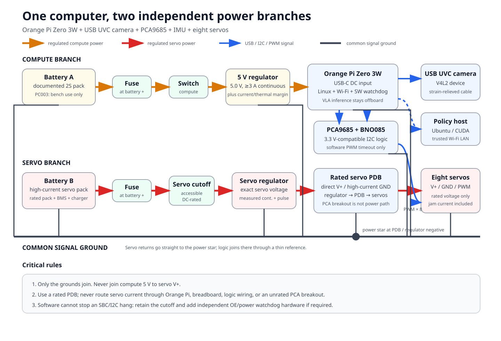

# Hardware reference: Orange Pi Zero 3W, camera, and two battery branches

This is the reference robot-side build for Sesame ML. One Orange Pi Zero 3W runs Linux,
captures the front camera and IMU, exchanges observations and action chunks over Wi-Fi, and
updates the eight servo signals. Large VLA and world-model inference remains on a workstation.
The PCA9685 is an I/O peripheral, not a second computer.



> **Electrical scope:** this is a conservative reference architecture, not a substitute for the
> datasheets of the exact battery, regulator, breakout, camera, and servos installed in a build.
> The servo model's rated voltage and current have not been established from the repository.
> Measure them before selecting the servo battery branch.

## Reference build and assumptions

The project reference is designed around an **Orange Pi Zero 3W** with an actively supported
Orange Pi Linux image, a small **USB UVC camera**, a PCA9685 servo PWM breakout, and a BNO085
IMU. The Zero 3W is the only computer carried by the robot. It is intentionally a transport and
real-time safety endpoint: the policy server normally runs on an Ubuntu/CUDA workstation or
another machine on the same trusted Wi-Fi network.

The electrical drawing makes these assumptions:

- the board is the Orange Pi Zero 3W shown in the manufacturer's current documentation, not the
  older and different Orange Pi Zero 3 or an Orange Pi Zero 2W;
- the Orange Pi is fed through its documented USB-C DC input;
- the camera enumerates as a Linux V4L2 device through a supported USB host port or adapter;
- the PCA9685 breakout exposes separate logic `VCC` and servo `V+` rails;
- every servo is rated for the chosen regulated servo voltage; and
- both battery branches have known polarity, protected cells or packs, and chargers intended for
  their chemistry and series-cell count.

The two positive power branches are independent, but the system is **not galvanically isolated**.
The Orange Pi, PCA9685, IMU, and servo supply need one common signal-ground reference for I2C and
PWM. Route high-current servo returns directly to the servo power-distribution/regulator-negative
point, then join the thin logic-ground reference there; servo current must not return through an
Orange Pi or PCA9685 logic-ground conductor. The `5 V compute` and servo positive rails never
join.

## Why the reference camera is USB UVC

The [official Zero 3W product page](https://www.orangepi.org/html/hardWare/computerAndMicrocontrollers/details/Orange-Pi-Zero-3W.html)
lists two four-lane MIPI-CSI interfaces. That describes electrical capability, not universal
camera-module compatibility. A CSI camera also needs the correct connector orientation and
pinout, lane mapping, sensor clock and power rails, kernel sensor driver, and device-tree
configuration for the exact board image.

Orange Pi's [13 MP Camera (13855) page](https://www.orangepi.org/html/hardWare/computerAndMicrocontrollers/details/13-MP-Camera-13855.html)
currently names the Orange Pi 5, 5B, 5 Plus, 6, and 6 Plus as suitable boards. It does **not** name
the Zero 3W. Marketplace titles may call a related module “13850,” which may identify its image
sensor rather than a board-compatible module. Neither the similar name nor a physically fitting
flex cable demonstrates Zero 3W compatibility.

For the public reference build, use a small camera that:

1. explicitly implements USB Video Class (UVC);
2. appears under `/dev/video*` on the selected Orange Pi image;
3. can deliver the configured resolution and frame rate without conversion stalls; and
4. has a short, strain-relieved cable or adapter appropriate to the board's USB host connector.

Linux documents the UVC driver and its device behavior in the
[kernel UVC documentation](https://docs.kernel.org/userspace-api/media/drivers/uvcvideo.html).
Sesame ML reads the camera through V4L2, so camera selection is not tied to one USB-camera brand.
Check the actual device before installing it in the case:

```bash
sudo apt install -y v4l-utils
v4l2-ctl --list-devices
v4l2-ctl --device /dev/video0 --list-formats-ext
v4l2-ctl --device /dev/video0 --all
```

Device numbering is not stable across every Linux installation. Pass the discovered device path
to `sesame-ml orange-client`; do not assume it will always be `/dev/video0`.

## Two-battery adaptation

Servo current pulses are a common cause of SBC resets and corrupted camera frames. The reference
adaptation therefore has two batteries and two regulators:

- **Compute branch:** compute battery → branch fuse → compute switch → regulated 5.0 V supply
  rated for at least the board-required 3 A continuously at worst-case battery voltage and
  temperature, with engineering margin → correctly wired USB-C DC input. The Orange Pi then
  powers only its low-current logic peripherals and camera.
- **Servo branch:** servo battery → branch fuse → accessible, DC-rated servo cutoff switch →
  regulated servo-rated voltage → separately rated power-distribution bus → eight servo power
  leads. Do not assume a PCA9685 breakout terminal or traces can carry the measured aggregate
  continuous and pulse current unless that exact board documents the rating.
- **Signal wiring:** Orange Pi I2C → PCA9685 logic `VCC`/`SDA`/`SCL`; PCA9685 PWM outputs → servo
  signal leads. The BNO085 can share the enabled I2C bus when its address does not conflict.
- **Ground:** run each servo return to the rated distribution bus and servo regulator negative.
  Join compute/logic ground to that point with a separate signal-reference conductor. Do not
  join the positive rails or put servo return current through logic wiring.

Do not feed a servo from the Orange Pi header, USB rail, or PCA9685 logic `VCC`. The PCA9685 chip
is a PWM controller, not a servo power regulator or a power-distribution rating for the breakout
that carries it. Its manufacturer documentation separates the logic supply and LED/PWM output
electrical limits; see the
[NXP PCA9685 data sheet](https://www.nxp.com/docs/en/data-sheet/PCA9685.pdf). The common hobby
breakout arrangement and its servo-power warnings are also documented by
[Adafruit's PCA9685 guide](https://learn.adafruit.com/16-channel-pwm-servo-driver/powering-servos).

The shipped software watchdog is a valuable operational control, but it is not an independent
fail-safe: it can write PCA9685 full-off only while the process, Linux scheduler and I2C path are
working. If an SBC/kernel/control-loop/I2C hang must remove motion, add an independent hardware
watchdog that drives PCA9685 `OE` to its disabled state or controls a suitably rated,
normally-disabled servo-power switch. Retain an accessible physical cutoff in either case.

### Reusing the Bambu 7.4 V pack

The previously purchased Bambu Lab PC003 pack is a **bench/experimental compute-branch reuse**,
not the public default and not a candidate for all eight servos. Bambu's
[PC003 product specification](https://us.store.bambulab.com/products/14500-7-4v-800mah-li-ion-battery-1pcs)
states 7.4 V nominal, 800 mAh, 3 A maximum continuous discharge, 8.4 V overcharge voltage, and
5.8 V over-discharge protection. Those values define a 5.92 Wh nominal pack; the 20 A protection
trip value listed by Bambu is **not** a usable continuous-current rating.

The [Orange Pi Zero 3W specification](https://www.orangepi.org/html/hardWare/computerAndMicrocontrollers/details/Orange-Pi-Zero-3W.html)
specifies a 5 V/3 A USB-C DC input. At that full 15 W input envelope, a buck converter that is 85%
efficient would draw approximately 3.0 A from the PC003 at its 5.8 V protection threshold:

```text
I_battery = P_output / (efficiency × V_battery)
          = 15 W / (0.85 × 5.8 V)
          ≈ 3.0 A
```

That leaves essentially no current or thermal margin for regulator loss, wiring, aging, or
transients. Therefore:

- PC003 is acceptable for an experimental compute branch only if an inline measurement shows
  that the
  Orange Pi, cooler, camera, IMU, and Wi-Fi workload remain below the pack, connector, and
  regulator ratings with engineering margin across the discharge range;
- do not infer suitability from capacity alone—verify peak current, voltage sag, regulator
  temperature, dropout, cutoff hysteresis, and runtime under the real camera/network workload;
  use a tested earlier undervoltage cutoff if the converter would otherwise approach the pack's
  5.8 V protection threshold; and
- for the reference build, prefer a manufacturer-assembled pack with greater continuous current
  and energy capacity, a documented protection/BMS, and a documented cell-balancing/charge
  method. Keep the regulated Orange Pi input at the manufacturer's 5 V requirement.

Use only the battery manufacturer's charger and limits. Charge each removable pack separately,
with the robot disarmed and not operating, on a nonflammable surface, and never attempt to
parallel the two packs. Secure each pack in an insulating enclosure with strain relief and use a
charger intended for its exact chemistry and series-cell count.

Use a correctly wired, fused USB-C 5 V source module and cable whose current and USB-C CC behavior
are appropriate for the Orange Pi DC input. Verify polarity and voltage at the connector before
plugging in the board; never inject power through an improvised cut USB cable.

### Selecting the servo branch

No single safe ampere number can be derived without the exact servos and mechanics. A servo's
stall current can be many times its unloaded current, and a leg collision can stall multiple
servos simultaneously. Start with manufacturer stall-current data. Measure one servo through its
real range on a current-limited dynamometer or controlled load, then repeat with simultaneous
legs. If a short obstruction test is unavoidable, time-bound it, keep the robot raised, monitor
servo temperature, use a current-limited supply, and keep the cutoff in hand.

Select the servo battery, regulator/BEC, switch, connectors, wiring, and fuse so that:

```text
regulator continuous rating >= 1.25 × measured sustained current
regulator pulse rating      >= 1.25 × measured simultaneous transient
battery/BMS current rating  >= regulator's required input current
fuse time-current curve     rides through normal pulses but protects the weakest downstream part
servo output voltage        is within the exact servo manufacturer's rating
```

The 25% values are a minimum design margin for this reference, not a substitute for component
derating curves. Verify regulator performance at the selected pack's documented full-charge and
cutoff voltages. If the installed servos are not explicitly rated for the pack's full-charge
voltage, a regulated servo rail is mandatory. Do not run high-current servo power through
solderless breadboards or ordinary Dupont jumpers. Put each fuse close to its battery positive
terminal. Its DC voltage and interrupt rating must exceed the available fault source, and its
time-current curve must ride through measured normal pulses while protecting at or below the
lowest safe rating of the downstream wire, connector, cutoff switch and distribution bus. Use
polarized, touch-safe connectors rated above the branch current.

A correctly rated, low-ESR bulk capacitor at the servo power-distribution bus can reduce local
voltage dips, but it does not make an undersized battery or regulator safe. Size it from
oscilloscope measurements, observe its voltage rating and polarity, and include inrush current
in the switch and connector review.

## Logic and signal wiring

The official Zero 3W page publishes a 40-pin header diagram with 3.3 V, ground, and multiple TWI
(I2C) functions. Use the pinout for the exact board revision and the bus enabled by the installed
device tree; do not copy Raspberry Pi or older Orange Pi pin numbers.

For a typical PCA9685 breakout:

| Orange Pi / supply | PCA9685 or peripheral | Rule |
|---|---|---|
| Verified 3.3 V logic rail | `VCC` | Logic only; never servo `V+` |
| Enabled TWI/I2C SDA | `SDA` | Confirm Linux bus number at runtime |
| Enabled TWI/I2C SCL | `SCL` | Keep wiring short and routed away from servo power |
| Thin logic reference | `GND` | Required for I2C/PWM; carries no servo return current |
| Rated servo distribution positive | servo power leads | Eight-servo rail; do not assume breakout traces suffice |
| PCA9685 PWM outputs | servo signal leads | Signal only |
| Servo distribution/regulator negative | servo returns + thin logic reference | Deliberate high-current star point |

Confirm that every breakout's I2C pull-ups terminate at 3.3 V. A breakout that pulls SDA/SCL to
5 V must be modified or used through a suitable bidirectional level shifter. Power the BNO085
according to the exact breakout documentation—the bare sensor and breakout-board input ratings
are not interchangeable.

## Power-budget worksheet

Record measurements rather than copying a forum estimate:

| Quantity | Compute branch | Servo branch |
|---|---:|---:|
| Battery chemistry / cells |  |  |
| Full / nominal / cutoff voltage |  |  |
| Pack or BMS continuous current |  |  |
| Regulator output voltage | 5.0 V | servo rated voltage |
| Regulator continuous / pulse rating |  |  |
| Idle current |  |  |
| Measured sustained current |  |  |
| Measured worst transient |  |  |
| Minimum voltage at the load |  |  |
| Fuse and wire rating |  |  |
| Peak regulator temperature |  |  |

For a first runtime estimate:

```text
nominal battery energy (Wh) = nominal voltage × capacity (Ah)
upper-bound runtime (h)     = energy × regulator efficiency / measured average load (W)
```

Real runtime will be shorter because of voltage cutoff, converter efficiency versus load,
temperature, cell aging, and servo duty cycle.

## Safe bring-up sequence

1. Remove propulsive load from the legs and keep the robot on a stand. Leave both batteries
   disconnected. Confirm connector keying, polarity, fuse placement, and that compute 5 V is not
   continuous with servo `V+`.
2. Power each regulator from a current-limited bench supply. Verify its output before connecting
   the Orange Pi or a servo. Sweep the expected battery voltage range when the regulator permits.
3. Connect the compute branch only. Boot Linux, capture camera frames, exercise Wi-Fi, and run a
   sustained CPU load while logging input voltage/current and regulator temperature.
4. Add PCA9685 logic and the IMU with servo power still absent. Confirm the selected bus with
   `i2cdetect -l`, then scan only that enabled bus. Verify that the Sesame ML software timeout
   writes PCA9685 full-off when the client stops.
5. Energize the servo regulator with every servo unplugged and check voltage and polarity at the
   most distant connector. Test the accessible, DC-rated servo cutoff switch.
6. Connect and calibrate one unloaded servo at a time with a current limit. Check direction,
   neutral, pulse range, and mechanical stops before enabling another channel.
7. Progress to one leg, Stand, and finally low-amplitude all-leg motion. Record current transients
   and supply droop. Stop if the Orange Pi logs undervoltage, the camera resets, Wi-Fi drops, a
   regulator overheats, or any connector becomes warm.
8. Test policy-server loss, Wi-Fi loss, robot-client termination, and compute-battery removal.
   Test an induced process stall as well. The first three cases should produce the configured
   software response; compute loss or an SBC/kernel/I2C hang requires the independent hardware
   `OE`/power cutoff if automatic removal of motion is a requirement.

After this checkout, the physical client can be started with the camera device and I2C bus found
on that robot:

```bash
uv run sesame-ml orange-client \
  --uri ws://POLICY_HOST:8765 \
  --robot-id sesame-001 \
  --camera /dev/video0 \
  --i2c-bus ACTUAL_BUS \
  --calibration ~/sesame-001.yaml \
  --fallback disable
```

Use a dedicated, trusted robot LAN during development. Do not expose an unauthenticated `ws://`
control server to the public internet.

## Source and validation notes

Sources were checked on 2026-07-12. Manufacturer documentation is authoritative for the board or
part it describes; the architecture and derating guidance are project recommendations:

- [Orange Pi Zero 3W product specifications and pinout](https://www.orangepi.org/html/hardWare/computerAndMicrocontrollers/details/Orange-Pi-Zero-3W.html)
- [Orange Pi Zero 3W service and download page](https://www.orangepi.org/html/hardWare/computerAndMicrocontrollers/service-and-support/Orange-Pi-Zero-3W.html)
- [Orange Pi 13 MP Camera (13855) compatibility list](https://www.orangepi.org/html/hardWare/computerAndMicrocontrollers/details/13-MP-Camera-13855.html)
- [Bambu Lab PC003 battery specifications and warnings](https://us.store.bambulab.com/products/14500-7-4v-800mah-li-ion-battery-1pcs)
- [NXP PCA9685 data sheet](https://www.nxp.com/docs/en/data-sheet/PCA9685.pdf)
- [Linux UVC driver documentation](https://docs.kernel.org/userspace-api/media/drivers/uvcvideo.html)

Before publishing measured runtime, current, or temperature numbers, repeat the power-budget
worksheet on the final hardware revision. This document deliberately does not claim that the
Orange Pi 5 camera module works on the Zero 3W or that the PC003 pack can power eight installed
servos.
